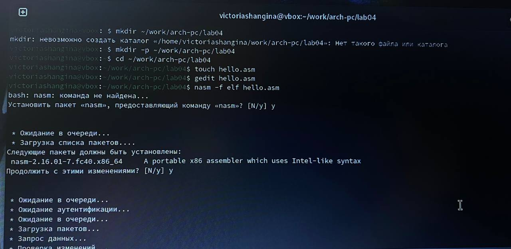

---
## Front matter
title: "Отчёт по лабораторной работе №4"
subtitle: "Дисциплина: архитектура компьютера"
author: "Шангина Виктория Андреевна, группа: НКАбд-05-24"

## Generic otions
lang: ru-RU
toc-title: "Содержание"

## Bibliography
bibliography: bib/cite.bib
csl: pandoc/csl/gost-r-7-0-5-2008-numeric.csl

## Pdf output format
toc: true # Table of contents
toc-depth: 2
lof: true # List of figures
lot: true # List of tables
fontsize: 12pt
linestretch: 1.5
papersize: a4
documentclass: scrreprt
## I18n polyglossia
polyglossia-lang:
  name: russian
  options:
	- spelling=modern
	- babelshorthands=true
polyglossia-otherlangs:
  name: english
## I18n babel
babel-lang: russian
babel-otherlangs: english
## Fonts
mainfont: IBM Plex Serif
romanfont: IBM Plex Serif
sansfont: IBM Plex Sans
monofont: IBM Plex Mono
mathfont: STIX Two Math
mainfontoptions: Ligatures=Common,Ligatures=TeX,Scale=0.94
romanfontoptions: Ligatures=Common,Ligatures=TeX,Scale=0.94
sansfontoptions: Ligatures=Common,Ligatures=TeX,Scale=MatchLowercase,Scale=0.94
monofontoptions: Scale=MatchLowercase,Scale=0.94,FakeStretch=0.9
mathfontoptions:
## Biblatex
biblatex: true
biblio-style: "gost-numeric"
biblatexoptions:
  - parentracker=true
  - backend=biber
  - hyperref=auto
  - language=auto
  - autolang=other*
  - citestyle=gost-numeric
## Pandoc-crossref LaTeX customization
figureTitle: "Рис."
tableTitle: "Таблица"
listingTitle: "Листинг"
lofTitle: "Список иллюстраций"
lotTitle: "Список таблиц"
lolTitle: "Листинги"
## Misc options
indent: true
header-includes:
  - \usepackage{indentfirst}
  - \usepackage{float} # keep figures where there are in the text
  - \floatplacement{figure}{H} # keep figures where there are in the text
---

# Цель работы

Цель данной лабораторной работы - освоить процедуры компиляции и сборки программ, написанных на ассемблере NASM.

# Задание

1. Создание программы Hello world!
2. Работа с транслятором NASM
3. Работа с расширенным синтаксисом командной строки NASM
4. Работа с компоновщиком LD
5. Запуск исполняемого файла
6. Выполнение заданий для самостоятельной работы.

# Теоретическое введение

Основными функциональными элементами любой ЭВМ являются центральный процессор, память и периферийные устройства. Взаимодействие этих устройств осуществляется через общую шину, к которой они подключены. Физически шина представляет собой большое количество проводников, соединяющих устройства друг с другом. В современных компьютерах проводники выполнены в виде электропроводящих дорожек на материнской плате. Основной задачей процессора является обработка информации, а также организация координации всех узлов компьютера. В состав центрального процессора входят следующие устройства:

- арифметико-логическое устройство (АЛУ) — выполняет логические и арифметические действия, необходимые для обработки информации, хранящейся в памяти;
- устройство управления (УУ) — обеспечивает управление и контроль всех устройств компьютера;
- регистры — сверхбыстрая оперативная память небольшого объёма, входящая в состав процессора, для временного хранения промежуточных результатов выполнения инструкций; регистры процессора делятся на два типа: регистры общего назначения и специальные регистры. Для того, чтобы писать программы на ассемблере, необходимо знать, какие регистры процессора существуют и как их можно использовать. Большинство команд в программах написанных на ассемблере используют регистры в каче- стве операндов. Практически все команды представляют собой преобразование данных хранящихся в регистрах процессора, это например пересылка данных между регистрами или между регистрами и памятью, преобразование (арифметические или логические операции) данных хранящихся в регистрах. Доступ к регистрам осуществляется не по адресам, как к основной памяти, а по именам. Каждый регистр процессора архитектуры x86 имеет свое название, состоящее из 2 или 3 букв латинского алфавита. В качестве примера приведем названия основных регистров общего назначения (именно эти регистры чаще всего используются при написании программ):
- RAX, RCX, RDX, RBX, RSI, RDI — 64-битные
- EAX, ECX, EDX, EBX, ESI, EDI — 32-битные
- AX, CX, DX, BX, SI, DI — 16-битные
- AH, AL, CH, CL, DH, DL, BH, BL — 8-битные

Другим важным узлом ЭВМ является оперативное запоминающее устройство (ОЗУ). ОЗУ — это быстродействующее энергозависимое запоминающее устройство, которое напрямую взаимодействует с узлами процессора, предназначенное для хранения программ и данных, с которыми процессор непосредственно работает в текущий момент. ОЗУ состоит из одинаковых пронумерованных ячеек памяти. Номер ячейки памяти — это адрес хранящихся в ней данных. Периферийные устройства в составе ЭВМ:

- устройства внешней памяти, которые предназначены для долговременного хранения больших объёмов данных.
- устройства ввода-вывода, которые обеспечивают взаимодействие ЦП с внешней средой.

В основе вычислительного процесса ЭВМ лежит принцип программного управления. Это означает, что компьютер решает поставленную задачу как последовательность действий, записанных в виде программы.

Коды команд представляют собой многоразрядные двоичные комбинации из 0 и 1. В коде машинной команды можно выделить две части: операционную и адресную. В операционной части хранится код команды, которую необходимо выполнить. В адресной части хранятся данные или адреса данных, которые участвуют в выполнении данной операции. При выполнении каждой команды процессор выполняет определённую последовательность стандартных действий, которая называется командным циклом процессора. Он заключается в следующем:

1. формирование адреса в памяти очередной команды;
2. считывание кода команды из памяти и её дешифрация;
3. выполнение команды;
4. переход к следующей команде.

Язык ассемблера (assembly language, сокращённо asm) — машинно-ориентированный язык низкого уровня. NASM — это открытый проект ассемблера, версии которого доступны под различные операционные системы и который позволяет получать объектные файлы для этих систем. В NASM используется Intel-синтаксис и поддерживаются инструкции x86-64.

# Выполнение лабораторной работы
## Создание программы Hello world!

При помощи mkdir создаю каталог для работы с программами на языке ассемблера NASM. Затем перехожу в созданный каталог и создаю текстовый файл с именем hello.asm. Далее открываем файл при помози текстового редактора gedit, так как этот пакет раннее не был установлен, следую подсказкам. (рис. [-@fig:001]).

{#fig:fig1 width=70%}

В текстовом редакторе ввожу нужный текст. (рис. [-@fig:002]).

{#fig:002 width=70%}

## Работа с транслятором NASM и с расширенным синтаксисом командной строки NASM

Для компиляции приведенного выше текста программы "Hello World" использую команду nasm -f elf hello.asm, предварительно устанавливая пакет "nasm". Далее выполняем следующую команду.
Далее скомпилирую исходный файл hello.asm в obj.o при помощи nasm -o obj.o -f elf -g -l list.lst hello.asm, при этом формат выходного файла будет elf, и в него будут включены символы для отладки (опция -g), кроме того, будет создан файл листинга list.lst (опция -l) (рис. [-@fig:003]).

{#fig:003 width=70%}

При помощи ls проверяем содержимое (рис. [-@fig:004]).

{#fig:004 width=70%}

## Работа с компоновщином LD

Передаю объектный файл на обработку компоновщику при помощи команды ld -m elf_i386 hello.o -o hello (рис. [-@fig:005]).
{#fig:005 width=70%}

## Запуск исполняемого файла

Запускаю на выполнение созданный файл hello (рис. [-@fig:006]).
{#fig:006 width=70%}

## Выполнение заданий для самостоятельной работы.

1. В каталоге ~/work/arch-pc/lab04 с помощью команды cp создаю копию файла hello.asm с именем lab4.asm (рис. [-@fig:007]).

{#fig:007 width=70%}

2. При помощи текстового редактора вношу изменения в текст программы в файле lab4.asm так,чтобы вместо Hello world! на экран выводилась строка с моими фамилией и именем. (рис. [-@fig:008]).

{#fig:008 width=70%}

3. Оттранслирую полученный текст программы lab4.asm в объектный файл (рис. [-@fig:009]).
{{#fig:009 width=70%}}

Выполняю компоновку объектного файла и запускаю получившийся исполняемый файл (рис. [-@fig:010]).

{#fig:010 width=70%}

4. Копирую файлы hello.asm и lab4.asm в локальный репозиторий в каталог ~/work/study/2024-2025/"Архитектура компьютера"/arch-pc/labs/lab04/ (рис. [-@fig:011]).

{#fig:011 width=70%}
 
5. Загружаю файлы на Github при помощи git add . , git commit и git push (рис. [-@fig:012]).
{ #fig:012 width=70% }

# Выводы

При выполнении данной лабораторной работы я освоила процедуры компиляции и сборки программ, написанных на ассемблере NASM.

# Список литературы{.unnumbered}
1. PDF файл: Лабораторная работа №4. Создание и процесс обработки программ на языке ассемблера NASM
::: {#refs}
:::
