---
## Front matter
title: "Отчёт по лабораторной работе 6"
subtitle: "дисциплина:	Архитектура компьютера"
author: "Шангина В. А НКАбд-05-24"

## Generic otions
lang: ru-RU
toc-title: "Содержание"

## Bibliography
bibliography: bib/cite.bib
csl: pandoc/csl/gost-r-7-0-5-2008-numeric.csl

## Pdf output format
toc: true # Table of contents
toc-depth: 2
lof: true # List of figures
lot: true # List of tables
fontsize: 12pt
linestretch: 1.5
papersize: a4
documentclass: scrreprt
## I18n polyglossia
polyglossia-lang:
  name: russian
  options:
	- spelling=modern
	- babelshorthands=true
polyglossia-otherlangs:
  name: english
## I18n babel
babel-lang: russian
babel-otherlangs: english
## Fonts
mainfont: PT Serif
romanfont: PT Serif
sansfont: PT Sans
monofont: PT Mono
mainfontoptions: Ligatures=TeX
romanfontoptions: Ligatures=TeX
sansfontoptions: Ligatures=TeX,Scale=MatchLowercase
monofontoptions: Scale=MatchLowercase,Scale=0.9
## Biblatex
biblatex: true
biblio-style: "gost-numeric"
biblatexoptions:
  - parentracker=true
  - backend=biber
  - hyperref=auto
  - language=auto
  - autolang=other*
  - citestyle=gost-numeric
## Pandoc-crossref LaTeX customization
figureTitle: "Рис."
tableTitle: "Таблица"
listingTitle: "Листинг"
lofTitle: "Список иллюстраций"
lotTitle: "Список таблиц"
lolTitle: "Листинги"
## Misc options
indent: true
header-includes:
  - \usepackage{indentfirst}
  - \usepackage{float} # keep figures where there are in the text
  - \floatplacement{figure}{H} # keep figures where there are in the text
---

# Цель работы

Целью работы является освоение арифметических инструкций языка ассемблера NASM.

# Выполнение лабораторной работы

## Символьные и численные данные в NASM

Я создаю каталог для программ лабораторной работы № 6, перехожу в него и создаю файл lab6-1.asm.

Программы, которые будут приведены далее, демонстрируют вывод символьных и численных значений, записанных в регистр eax.

В первой программе в регистр eax записывается символ 6 с помощью команды mov eax, '6', а в регистр ebx – символ 4 с помощью команды mov ebx, '4'. Далее, к значению в регистре eax прибавляется значение регистра ebx командой add eax, ebx. Результат сложения записывается в регистр eax. После этого выводится результат. 

Так как функция sprintLF требует, чтобы в регистр eax был записан адрес, используется дополнительная переменная. Для этого записываю значение из регистра eax в переменную buf1 командой mov [buf1], eax, затем записываю адрес переменной buf1 в регистр eax командой mov eax, buf1 и вызываю функцию sprintLF.

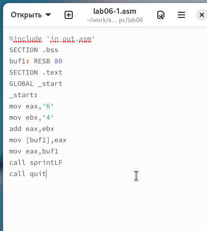{ #fig:001 width=70%, height=70% }

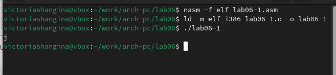{ #fig:002 width=70%, height=70% }

При выводе значения из регистра eax мы ожидаем увидеть число 10. Однако результатом будет символ j. Это происходит потому, что код символа 6 равен 54 в десятичной системе (или 00110110 в двоичной), а код символа 4 – 52 в десятичной системе (или 00110100 в двоичной). После выполнения команды add eax, ebx, в регистр eax записывается сумма кодов, равная 106, что соответствует символу j.

Далее, в программе вместо символов записываю в регистры числа.

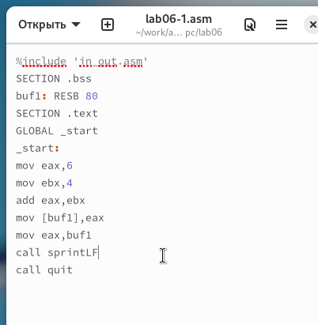{ #fig:003 width=70%, height=70% }

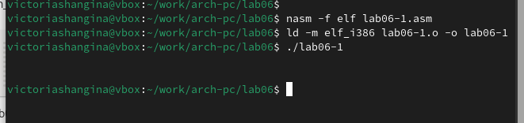{ #fig:004 width=70%, height=70% }

Как и в предыдущем примере, выводится не число 10, а символ с кодом 10, который представляет собой символ конца строки. Этот символ не отображается в консоли, но добавляет пустую строку.

Для работы с числами в файле in_out.asm реализованы функции для преобразования символов ASCII в числа и наоборот. Преобразую программу с использованием этих функций.

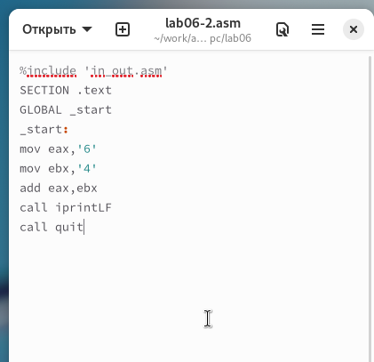{ #fig:005 width=70%, height=70% }

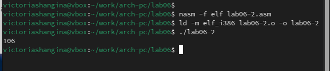{ #fig:006 width=70%, height=70% }

Результатом работы программы будет число 106. Здесь, как и в первом примере, команда add складывает коды символов 6 и 4 (54 + 52 = 106). Однако, в отличие от предыдущей программы, функция iprintLF позволяет вывести именно число, а не символ, соответствующий данному коду.

Заменяю символы на числа.

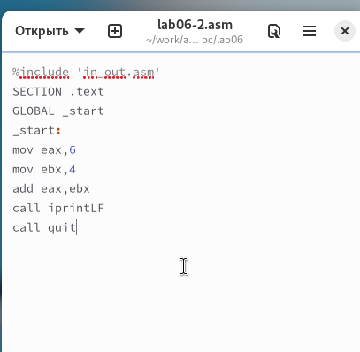{ #fig:007 width=70%, height=70% }

В данном случае, благодаря функции iprintLF, выводится число 10, так как операндами являются числа.

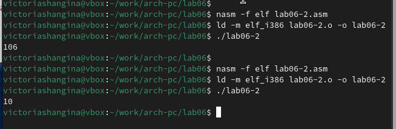{ #fig:008 width=70%, height=70% }

Заменяю функцию iprintLF на iprint и создаю исполняемый файл, затем запускаю программу. Вывод отличается тем, что теперь нет переноса строки.

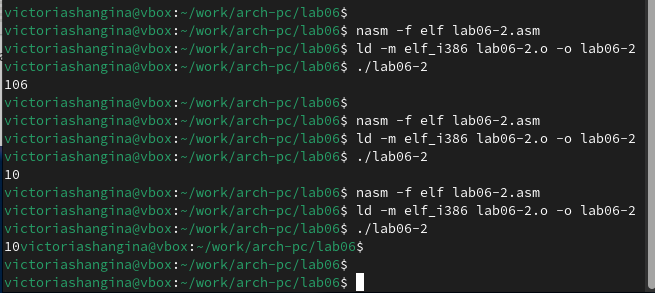{ #fig:009 width=70%, height=70% }

## Выполнение арифметических операций в NASM

Примером арифметических операций в NASM будет программа для вычисления выражения $ f(x) = (5 * 2 + 3)/3 $.

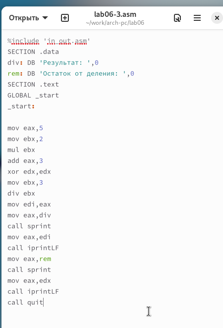{ #fig:010 width=70%, height=70% }

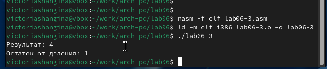{ #fig:011 width=70%, height=70% }

Изменяю программу для вычисления выражения $ f(x) = (4 * 6 + 2)/5 $. Создаю исполняемый файл и проверяю его работу.

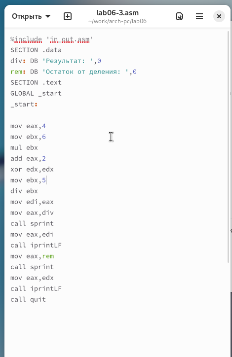{ #fig:012 width=70%, height=70% }

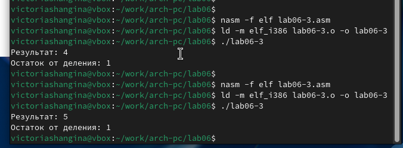{ #fig:013 width=70%, height=70% }

Другим примером будет программа для вычисления варианта задания по номеру студенческого билета. В этом случае число, с которым производятся арифметические операции, вводится с клавиатуры. Для корректной работы с числами, введенные символы необходимо преобразовать в числовой формат, для чего используется функция atoi из файла in_out.asm.

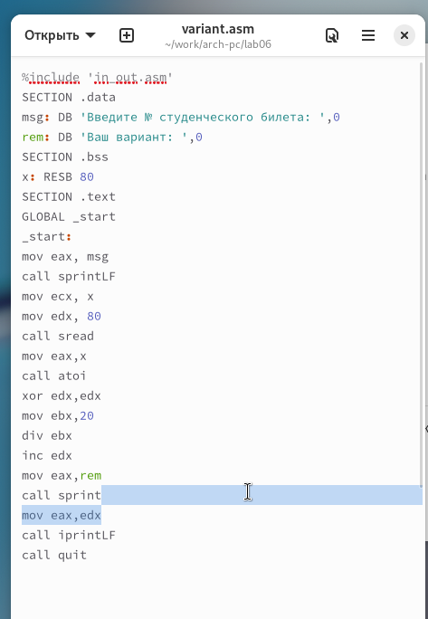{ #fig:014 width=70%, height=70% }

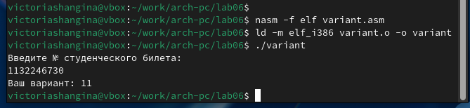{ #fig:015 width=70%, height=70% }

## Ответы на вопросы

1. **Какие строки листинга отвечают за вывод на экран сообщения ‘Ваш вариант:’?**
   - Инструкция mov eax, rem записывает значение переменной с фразой ‘Ваш вариант:’ в регистр eax.
   - Инструкция call sprint вызывает подпрограмму для вывода строки.

2. **Для чего используются следующие инструкции?**
   - mov ecx, x — записывает значение переменной x в регистр ecx.
   - mov edx, 80 — записывает значение 80 в регистр edx.
   - call sread — вызывает подпрограмму для считывания значения студенческого билета.

3. **Для чего используется инструкция “call atoi”?**
   - Инструкция “call atoi” используется для преобразования введенных символов в числовой формат.

4. **Какие строки листинга отвечают за вычисления варианта?**
   - xor edx, edx — обнуляет регистр edx.
   - mov ebx, 20 — записывает значение 20 в регистр ebx.
   - div ebx — выполняет деление номера студенческого билета на 20.
   - inc edx — увеличивает значение в регистре edx на 1.

   Здесь происходит деление номера студенческого билета на 20. Остаток записывается в регистр edx, к которому добавляется 1.

5. **В какой регистр записывается остаток от деления при выполнении инструкции “div ebx”?**
   - Остаток от деления записывается в регистр edx.

6. **Для чего используется инструкция “inc edx”?**
   - Инструкция “inc edx” увеличивает значение в регистре edx на 1, согласно формуле вычисления варианта.

7. **Какие строки листинга отвечают за вывод на экран результата вычислений?**
   - Инструкция mov eax, edx записывает результат в регистр eax.
   - Инструкция call iprintLF вызывает подпрограмму для вывода значения на экран.

## Задание для самостоятельной работы

Необходимо написать программу для вычисления выражения $ y = f(x) $, которая должна выводить выражение для вычисления, запросить ввод значения x, вычислить выражение в зависимости от введенного значения и вывести результат. Вид функции $ f(x) $ должен быть выбран согласно таблице 6.3 вариантов заданий.

Мы получили вариант 11 для выражения $ 10(x+1)-10 $ с $ x=1, x=7 $.

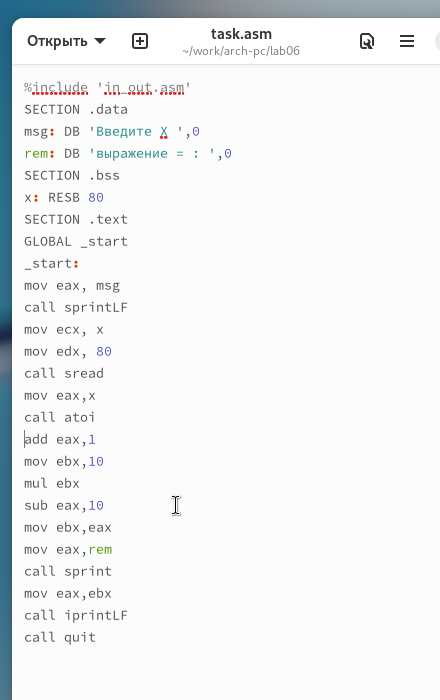{ #fig:016 width=70%, height=70% }

При $ x=1 $ результат равен 10.

При $ x=7 $ результат равен 70.

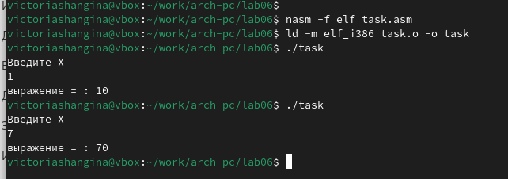{ #fig:017 width=70%, height=70% }

Программа работает правильно.

# Выводы

Изучили работу с арифметическими операциями.