---
## Front matter
title: "Отчёт по лабораторной работе 8"
subtitle: "дисциплина:	Архитектура компьютера"
author: "Шангина В. А НКАбд-05-24"

## Generic otions
lang: ru-RU
toc-title: "Содержание"

## Bibliography
bibliography: bib/cite.bib
csl: pandoc/csl/gost-r-7-0-5-2008-numeric.csl

## Pdf output format
toc: true # Table of contents
toc-depth: 2
lof: true # List of figures
lot: true # List of tables
fontsize: 12pt
linestretch: 1.5
papersize: a4
documentclass: scrreprt
## I18n polyglossia
polyglossia-lang:
  name: russian
  options:
	- spelling=modern
	- babelshorthands=true
polyglossia-otherlangs:
  name: english
## I18n babel
babel-lang: russian
babel-otherlangs: english
## Fonts
mainfont: PT Serif
romanfont: PT Serif
sansfont: PT Sans
monofont: PT Mono
mainfontoptions: Ligatures=TeX
romanfontoptions: Ligatures=TeX
sansfontoptions: Ligatures=TeX,Scale=MatchLowercase
monofontoptions: Scale=MatchLowercase,Scale=0.9
## Biblatex
biblatex: true
biblio-style: "gost-numeric"
biblatexoptions:
  - parentracker=true
  - backend=biber
  - hyperref=auto
  - language=auto
  - autolang=other*
  - citestyle=gost-numeric
## Pandoc-crossref LaTeX customization
figureTitle: "Рис."
tableTitle: "Таблица"
listingTitle: "Листинг"
lofTitle: "Список иллюстраций"
lotTitle: "Список таблиц"
lolTitle: "Листинги"
## Misc options
indent: true
header-includes:
  - \usepackage{indentfirst}
  - \usepackage{float} # keep figures where there are in the text
  - \floatplacement{figure}{H} # keep figures where there are in the text
---

# Цель работы

Целью работы является приобретение навыков написания программ с использованием циклов и обработкой аргументов командной строки..

# Выполнение лабораторной работы

## Реализация циклов в NASM

Создала каталог для программ лабораторной работы № 8 и файл lab8-1.asm (рис. [-@fig:001]).

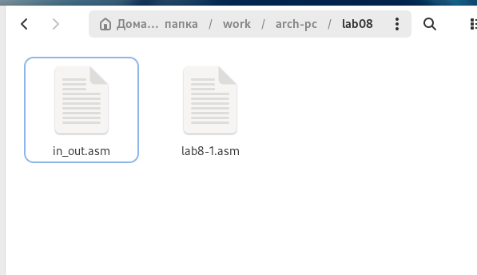{ #fig:001 width=70%, height=70% }

При реализации циклов в NASM с использованием инструкции loop важно помнить, что эта инструкция использует регистр ecx в качестве счетчика и на каждом шаге уменьшает его значение на единицу. В качестве примера рассмотрим программу, которая выводит значение регистра ecx. 

Написала в файл lab8-1.asm текст программы из листинга 8.1. (рис. [-@fig:002]). Создала исполняемый файл и проверила его работу. (рис. [-@fig:003]).

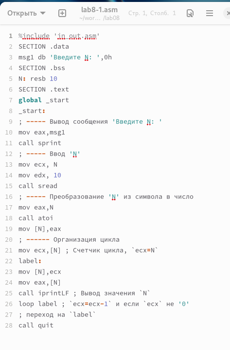{ #fig:002 width=70%, height=70% }

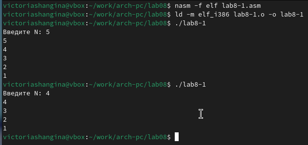{ #fig:003 width=70%, height=70% }

Этот пример демонстрирует, что использование регистра ecx в теле цикла loop может привести к некорректной работе программы. Изменила текст программы, добавив изменение значения регистра ecx в цикле. (рис. [-@fig:004]). Программа теперь запускает бесконечный цикл при нечетном N и выводит только нечетные числа при четном N. (рис. [-@fig:005]).

{ #fig:004 width=70%, height=70% }

{ #fig:005 width=70%, height=70% }

Для корректной работы программы с регистром ecx в цикле можно использовать стек. Внесла изменения в текст программы, добавив команды push и pop (для добавления в стек и извлечения из него значений), чтобы сохранить значение счетчика цикла loop. (рис. [-@fig:006]). Создала исполняемый файл и проверила его работу. (рис. [-@fig:007]). Программа теперь выводит числа от N-1 до 0, при этом число проходов цикла соответствует значению N.

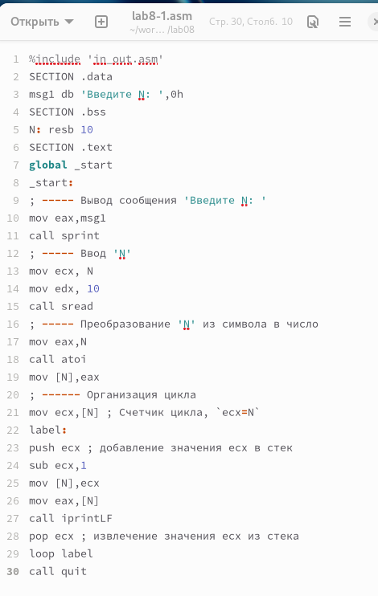{ #fig:006 width=70%, height=70% }

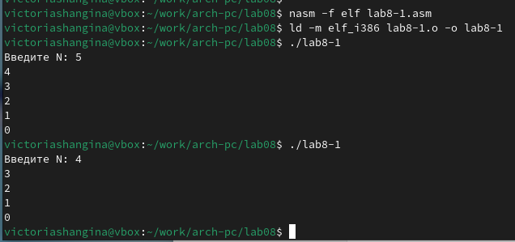{ #fig:007 width=70%, height=70% }

Создала файл lab8-2.asm в каталоге ~/work/arch-pc/lab08 и написала в него текст программы из листинга 8.2. (рис. [-@fig:008]). Компилирую исполняемый файл и запускаю его, указав аргументы. Программа обработала 4 аргумента. Аргументами считаются слова/числа, разделенные пробелом. (рис. [-@fig:009]).

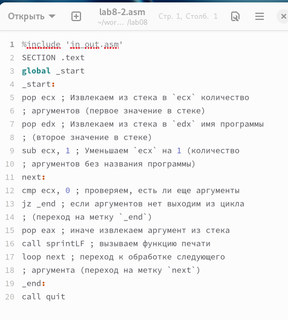{ #fig:008 width=70%, height=70% }

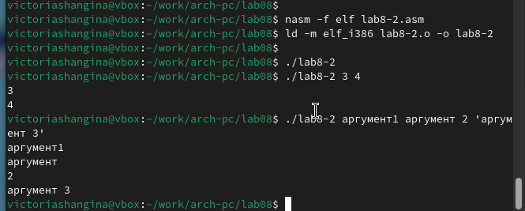{ #fig:009 width=70%, height=70% }

Рассмотрим еще один пример программы, которая выводит сумму чисел, передаваемых в программу как аргументы. (рис. [-@fig:010]) (рис. [-@fig:011]).

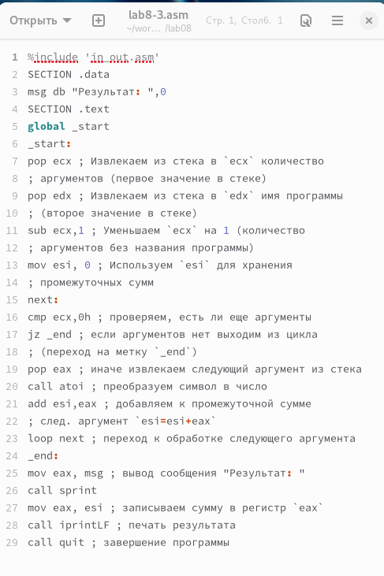{ #fig:010 width=70%, height=70% }

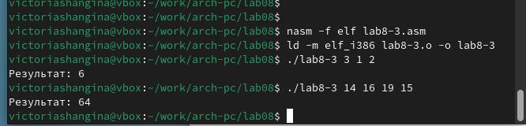{ #fig:011 width=70%, height=70% }

Изменила текст программы из листинга 8.3 для вычисления произведения аргументов командной строки. (рис. [-@fig:012]) (рис. [-@fig:013]).

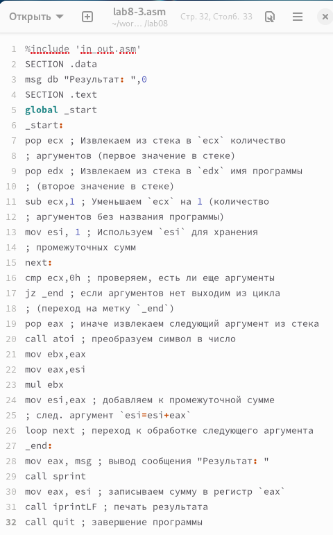{ #fig:012 width=70%, height=70% }

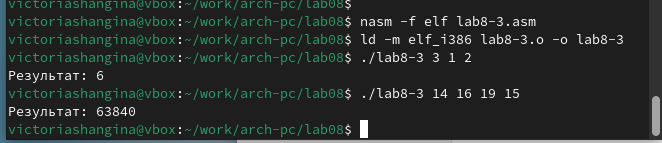{ #fig:013 width=70%, height=70% }

## Самостоятельное задание

Напишите программу, которая находит сумму значений функции 
$f(x)$ для $x = x_1, x_2, ..., x_n$, т.е. программа должна выводить значение 
$f(x_1) + f(x_2)+ ... +f(x_n)$. 
Значения $x$ передаются как аргументы. 
Вид функции $f(x)$ следует выбрать согласно таблице 8.1 вариантов заданий в соответствии с вариантом, 
полученным при выполнении лабораторной работы № 7. 
Создала исполняемый файл и проверила его работу на нескольких наборах $x$. (рис. [-@fig:014]) (рис. [-@fig:015]).

Для варианта 11 $$f(x) = 15x + 2$$ 

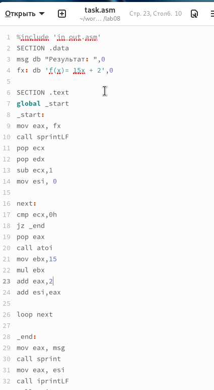{ #fig:014 width=70%, height=70% }

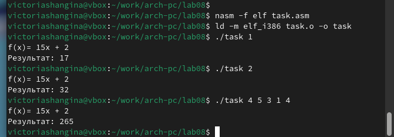{ #fig:015 width=70%, height=70% }

Убедилась, что программа правильно вычисляет $f(1)=17, f(2)=32$.

# Выводы

Освоила работу со стеком, циклами и аргументами на ассемблере NASM.
