---
## Front matter
title: "Отчёт по лабораторной работе 9"
subtitle: "дисциплина:	Архитектура компьютера"
author: "Шангина В. А НКАбд-05-24"

## Generic otions
lang: ru-RU
toc-title: "Содержание"

## Bibliography
bibliography: bib/cite.bib
csl: pandoc/csl/gost-r-7-0-5-2008-numeric.csl

## Pdf output format
toc: true # Table of contents
toc-depth: 2
lof: true # List of figures
lot: true # List of tables
fontsize: 12pt
linestretch: 1.5
papersize: a4
documentclass: scrreprt
## I18n polyglossia
polyglossia-lang:
  name: russian
  options:
	- spelling=modern
	- babelshorthands=true
polyglossia-otherlangs:
  name: english
## I18n babel
babel-lang: russian
babel-otherlangs: english
## Fonts
mainfont: PT Serif
romanfont: PT Serif
sansfont: PT Sans
monofont: PT Mono
mainfontoptions: Ligatures=TeX
romanfontoptions: Ligatures=TeX
sansfontoptions: Ligatures=TeX,Scale=MatchLowercase
monofontoptions: Scale=MatchLowercase,Scale=0.9
## Biblatex
biblatex: true
biblio-style: "gost-numeric"
biblatexoptions:
  - parentracker=true
  - backend=biber
  - hyperref=auto
  - language=auto
  - autolang=other*
  - citestyle=gost-numeric
## Pandoc-crossref LaTeX customization
figureTitle: "Рис."
tableTitle: "Таблица"
listingTitle: "Листинг"
lofTitle: "Список иллюстраций"
lotTitle: "Список таблиц"
lolTitle: "Листинги"
## Misc options
indent: true
header-includes:
  - \usepackage{indentfirst}
  - \usepackage{float} # keep figures where there are in the text
  - \floatplacement{figure}{H} # keep figures where there are in the text
---

# Цель работы

Целью работы является приобретение навыков написания программ с использованием подпрограмм.
Знакомство с методами отладки при помощи GDB и его основными возможностями.

# Выполнение лабораторной работы

## Реализация подпрограмм в NASM

Сначала я создала новую папку для выполнения лабораторной работы №9 и перешла в нее. Затем создала файл с именем lab9-1.asm.

В качестве примера я реализовала программу, вычисляющую арифметическое выражение $f(x) = 2x + 7$ с использованием подпрограммы calcul. Значение переменной $x$ вводится с клавиатуры, а само выражение вычисляется в подпрограмме. 

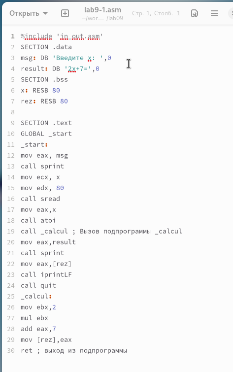{ #fig:001 width=70%, height=70% }

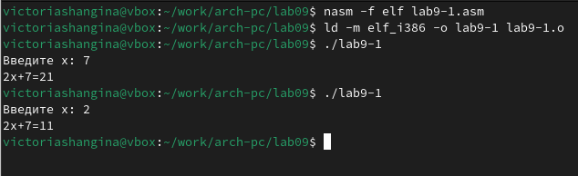{ #fig:002 width=70%, height=70% }

Затем я изменила текст программы, добавив подпрограмму subcalcul внутрь подпрограммы calcul. Это позволило вычислять составное выражение $f(g(x))$, где $f(x) = 2x + 7$, $g(x) = 3x - 1$. Значение $x$ также вводится с клавиатуры.

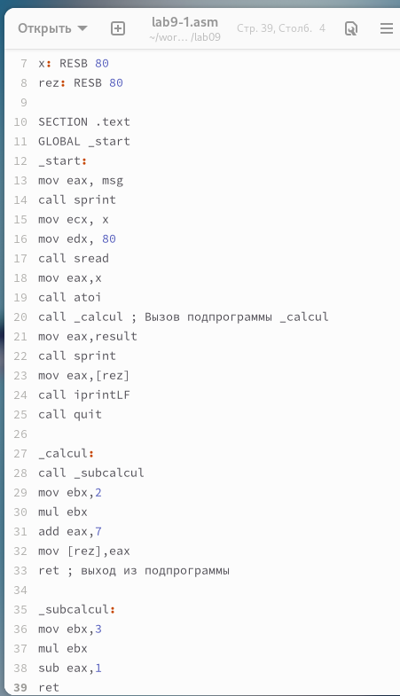{ #fig:003 width=70%, height=70% }

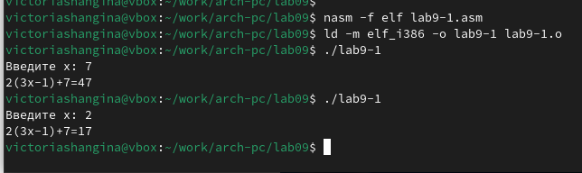{ #fig:004 width=70%, height=70% }

## Отладка программы с помощью GDB

Я создала файл lab9-2.asm, содержащий программу для вывода сообщения "Hello, world!" (Листинг 9.2).

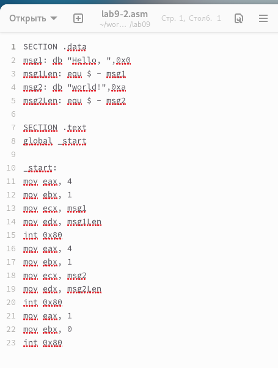{ #fig:005 width=70%, height=70% }

Скомпилировала файл с ключом -g для добавления отладочной информации и загрузила его в GDB. Затем запустила программу командой run.

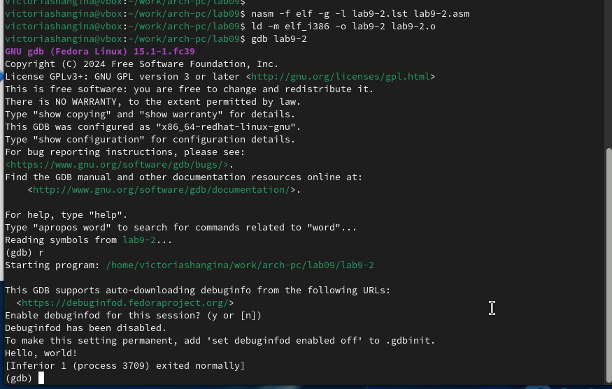{ #fig:006 width=70%, height=70% }

Установила точку останова на метке _start, запустила программу, а затем просмотрела дизассемблированный код.

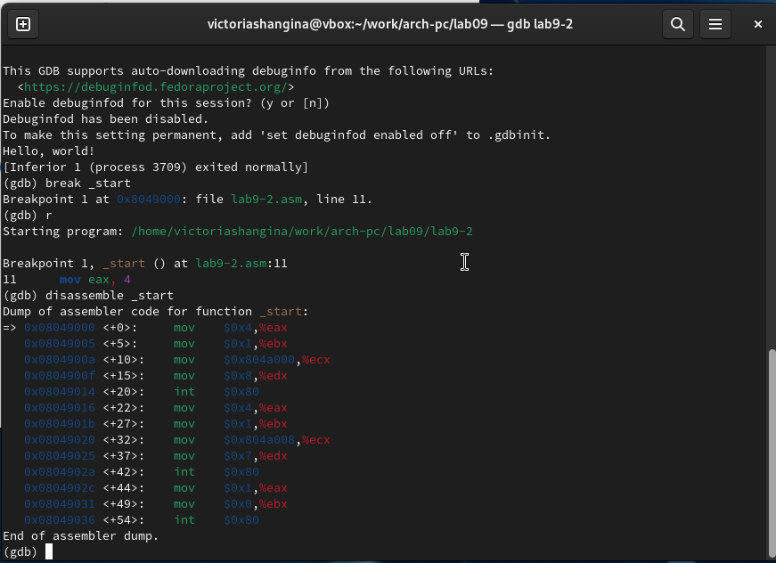{ #fig:007 width=70%, height=70% }

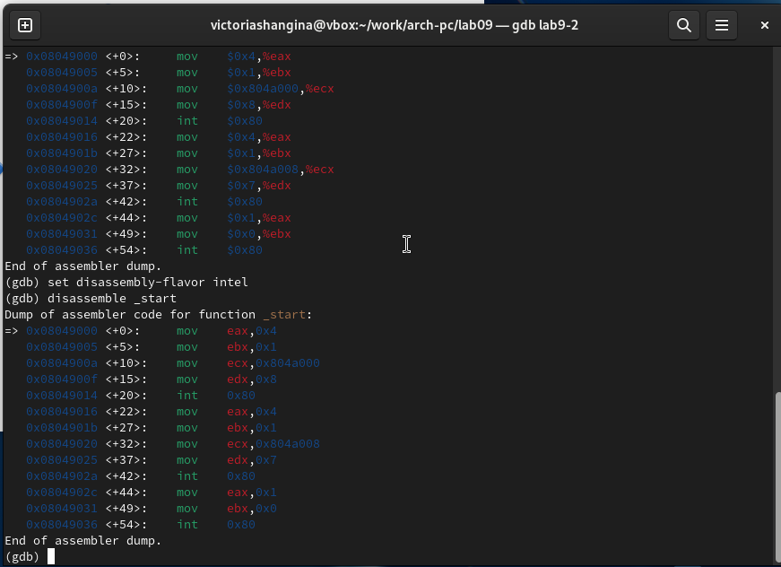{ #fig:008 width=70%, height=70% }

Установила дополнительные точки останова, используя команды info breakpoints и break. Например, добавила точку на инструкции mov ebx, 0x0.

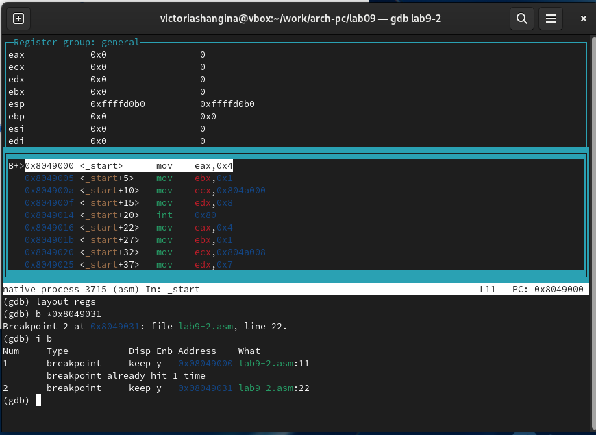{ #fig:009 width=70%, height=70% }

С помощью команды stepi (или si) я пошагово выполняла инструкции, отслеживая изменения регистров.

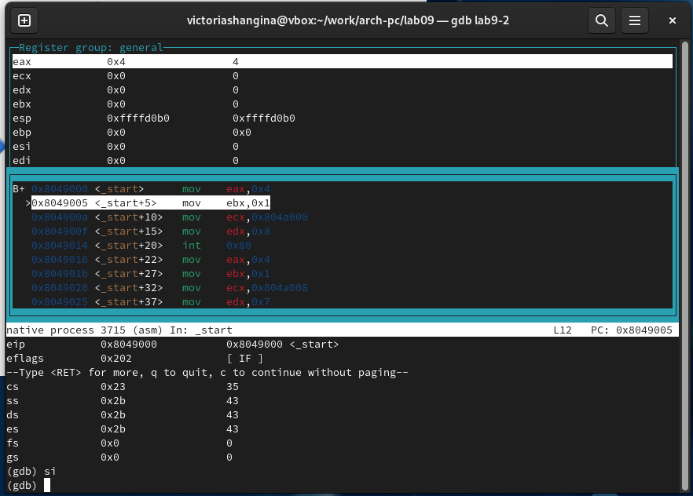{ #fig:010 width=70%, height=70% }

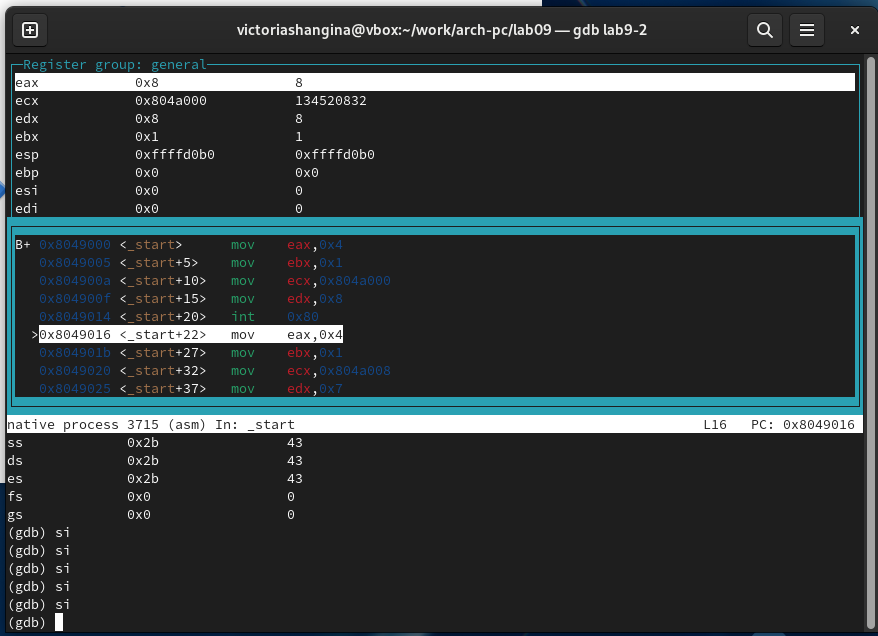{ #fig:011 width=70%, height=70% }

Я также изменила значение переменной msg1 и регистров, используя команду set.

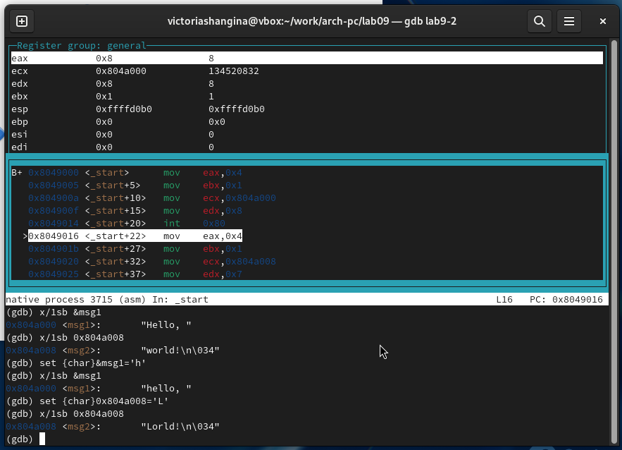{ #fig:012 width=70%, height=70% }

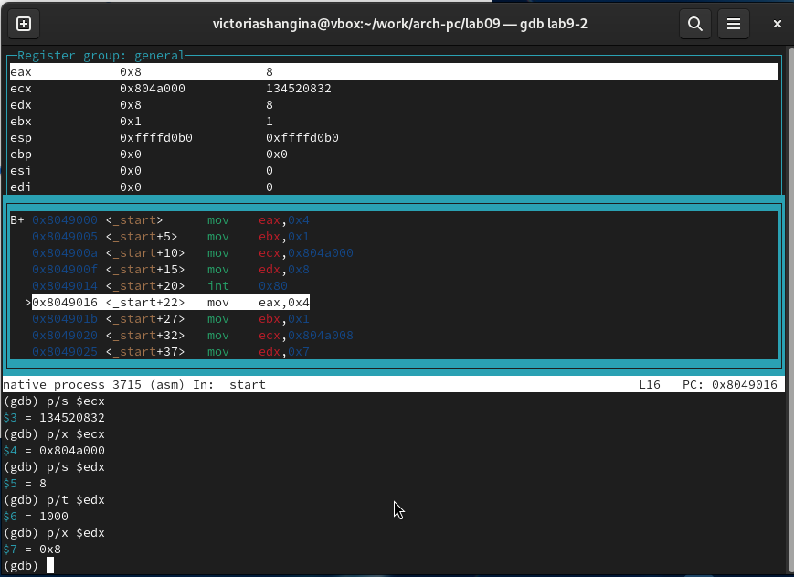{ #fig:013 width=70%, height=70% }

Используя аналогичные команды, я изменила значение регистра ebx.

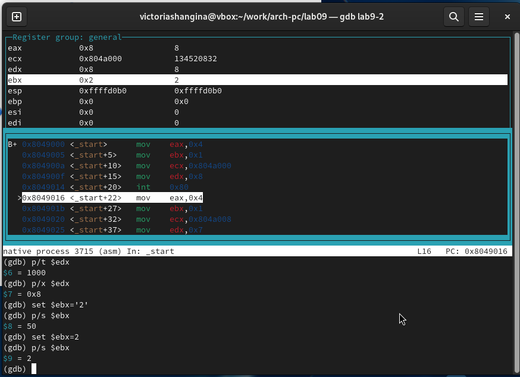{ #fig:014 width=70%, height=70% }

## Работа с аргументами командной строки

Для работы с аргументами командной строки я использовала файл lab8-2.asm (из лабораторной работы №8), создав из него исполняемый файл. Затем загрузила программу в GDB с аргументами, используя ключ --args.

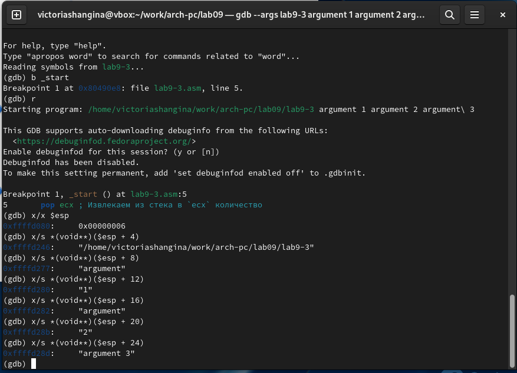{ #fig:015 width=70%, height=70% }

## Задание для самостоятельной работы

В рамках задания я модифицировала программу из лабораторной работы №8, добавив подпрограмму для вычисления функции $f(x)$.

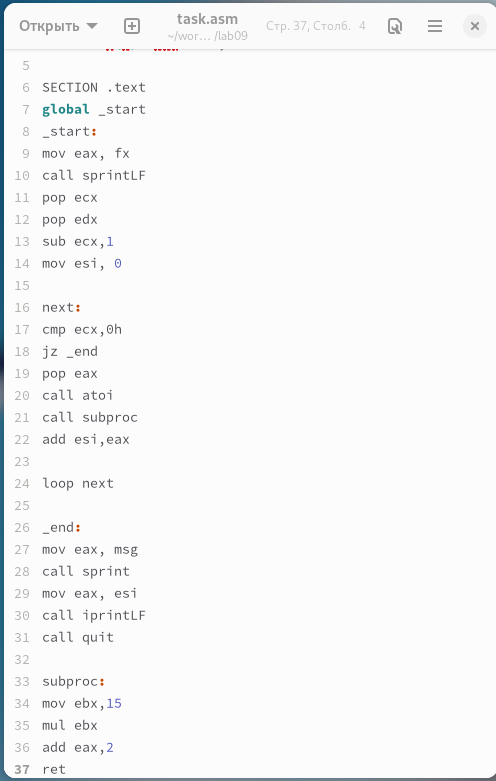{ #fig:016 width=70%, height=70% }

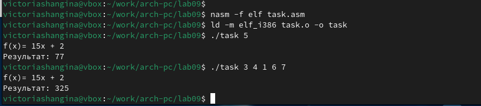{ #fig:017 width=70%, height=70% }

В процессе выполнения программы я обнаружила ошибку: порядок аргументов в инструкции add был перепутан, а регистр ebx вместо eax отправлялся в edi. 

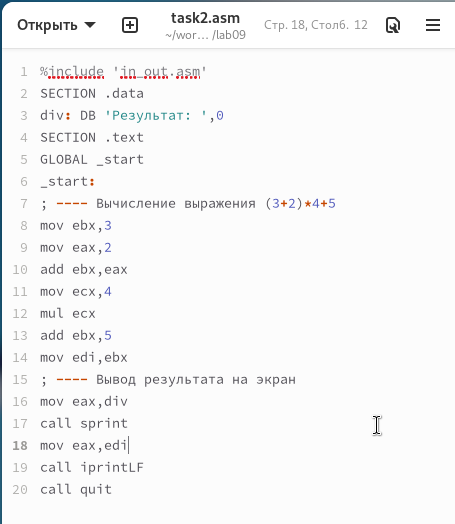{ #fig:018 width=70%, height=70% }

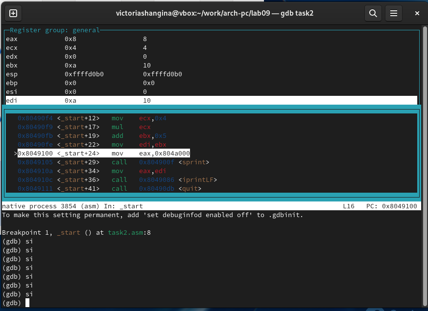{ #fig:019 width=70%, height=70% }

После исправления ошибок программа заработала корректно.

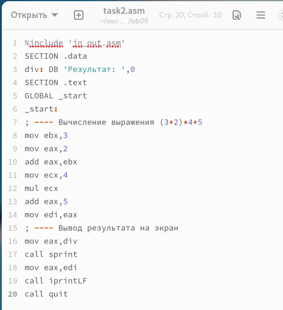{ #fig:020 width=70%, height=70% }

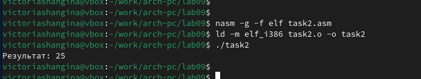{ #fig:021 width=70%, height=70% }

## Выводы

В ходе лабораторной работы я научилась работать с подпрограммами и отладчиком GDB, а также диагностировать и исправлять ошибки в ассемблерных программах.
