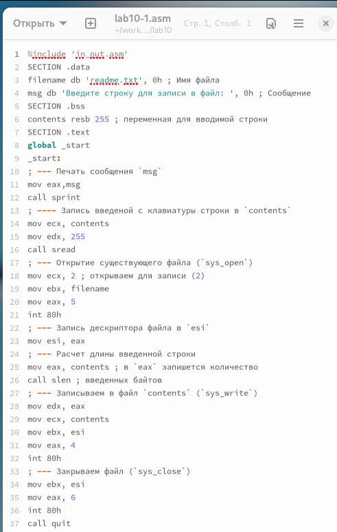
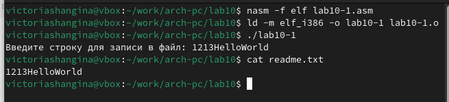
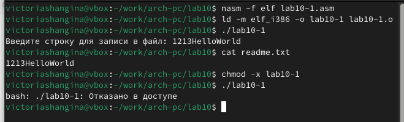
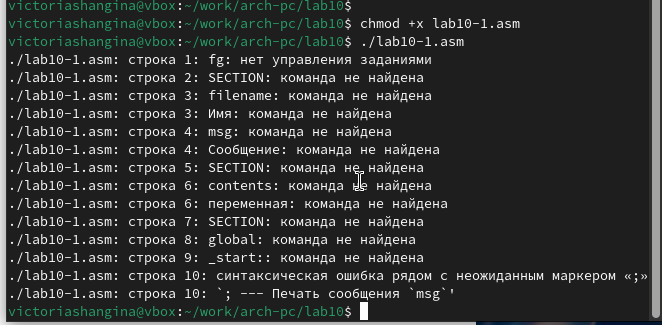
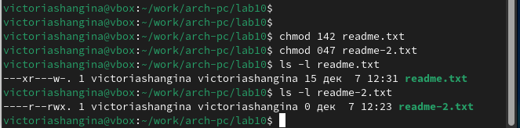
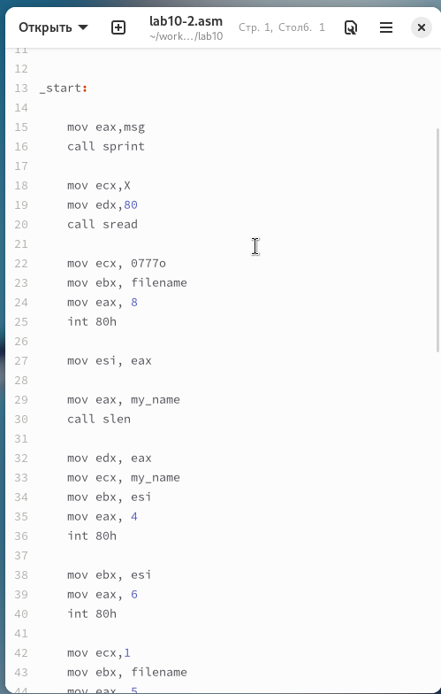
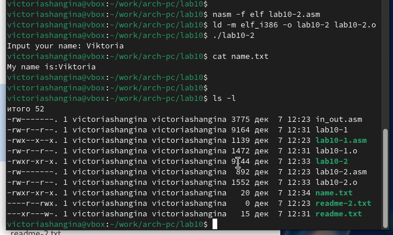

---
## Front matter
title: "Отчёт по лабораторной работе 10"
subtitle: "дисциплина:	Архитектура компьютера"
author: "Шангина В. А НКАбд-05-24"

## Generic otions
lang: ru-RU
toc-title: "Содержание"

## Bibliography
bibliography: bib/cite.bib
csl: pandoc/csl/gost-r-7-0-5-2008-numeric.csl

## Pdf output format
toc: true # Table of contents
toc-depth: 2
lof: true # List of figures
lot: true # List of tables
fontsize: 12pt
linestretch: 1.5
papersize: a4
documentclass: scrreprt
## I18n polyglossia
polyglossia-lang:
  name: russian
  options:
	- spelling=modern
	- babelshorthands=true
polyglossia-otherlangs:
  name: english
## I18n babel
babel-lang: russian
babel-otherlangs: english
## Fonts
mainfont: PT Serif
romanfont: PT Serif
sansfont: PT Sans
monofont: PT Mono
mainfontoptions: Ligatures=TeX
romanfontoptions: Ligatures=TeX
sansfontoptions: Ligatures=TeX,Scale=MatchLowercase
monofontoptions: Scale=MatchLowercase,Scale=0.9
## Biblatex
biblatex: true
biblio-style: "gost-numeric"
biblatexoptions:
  - parentracker=true
  - backend=biber
  - hyperref=auto
  - language=auto
  - autolang=other*
  - citestyle=gost-numeric
## Pandoc-crossref LaTeX customization
figureTitle: "Рис."
tableTitle: "Таблица"
listingTitle: "Листинг"
lofTitle: "Список иллюстраций"
lotTitle: "Список таблиц"
lolTitle: "Листинги"
## Misc options
indent: true
header-includes:
  - \usepackage{indentfirst}
  - \usepackage{float} # keep figures where there are in the text
  - \floatplacement{figure}{H} # keep figures where there are in the text
---

# Цель работы

Целью работы является приобретение навыков написания программ для работы с файлами.

# Выполнение лабораторной работы

Я создала каталог для лабораторной работы №10 и перешла в него.  
Внутри каталога я создала три файла: lab10-1.asm, readme-1.txt и readme-2.txt.

В файле lab10-1.asm я написала программу согласно листингу 10.1,  
которая записывает сообщение в файл.  
После этого я преобразовала код в исполняемый файл и проверила его работу. (рис. [-@fig:001])

{ #fig:001 width=70%, height=70% }

Программа запрашивает строку и записывает её в файл readme.txt.  
Однако, если файл не существует, он не создается, и строка не записывается. (рис. [-@fig:002])

{ #fig:002 width=70%, height=70% }

Чтобы запретить выполнение исполняемого файла lab10-1,  
я использовала команду `chmod` для изменения прав доступа и убрала атрибут "x" во всех трех позициях.

После этого я попыталась запустить файл, но он не запускался, так как атрибут "x" был снят. (рис. [-@fig:003])

{ #fig:003 width=70%, height=70% }

Я снова изменила права доступа к файлу lab10-1.asm, добавив разрешение на его выполнение с помощью команды `chmod`.  
После этого я попыталась запустить файл. (рис. [-@fig:004])  
Файл был успешно запущен, но терминал попытался интерпретировать его содержимое как команды,  
что вызвало ошибки, так как это был файл с кодом на языке ассемблера, а не команды для терминала.

{ #fig:004 width=70%, height=70% }

Затем я настроила права доступа к файлам readme согласно таблице 10.4.  
Для проверки правильности настроек я использовала команду `ls -l` и вывела атрибуты. (рис. [-@fig:005])

Для варианта 11: ```--x r-- -w-``` ```000 100 111```

{ #fig:005 width=70%, height=70% }

## Самостоятельное задание

Я написала программу, работающую по следующему алгоритму (рис. [-@fig:006]) (рис. [-@fig:007]):

- Вывод приглашения “Как Вас зовут?”
- Вводим с клавиатуры фамилию и имя
- Создаём файл с именем `name.txt`
- Записываем в файл сообщение “Меня зовут”
- Дописываем в файл введённую с клавиатуры строку
- Закрываем файл

{ #fig:006 width=70%, height=70% }

{ #fig:007 width=70%, height=70% }

# Выводы

Я овладела навыками работы с файлами и правами доступа.
